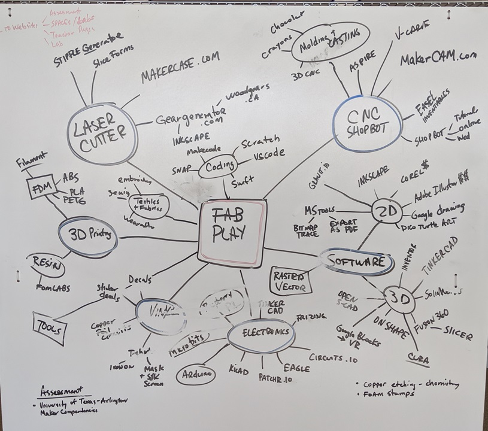
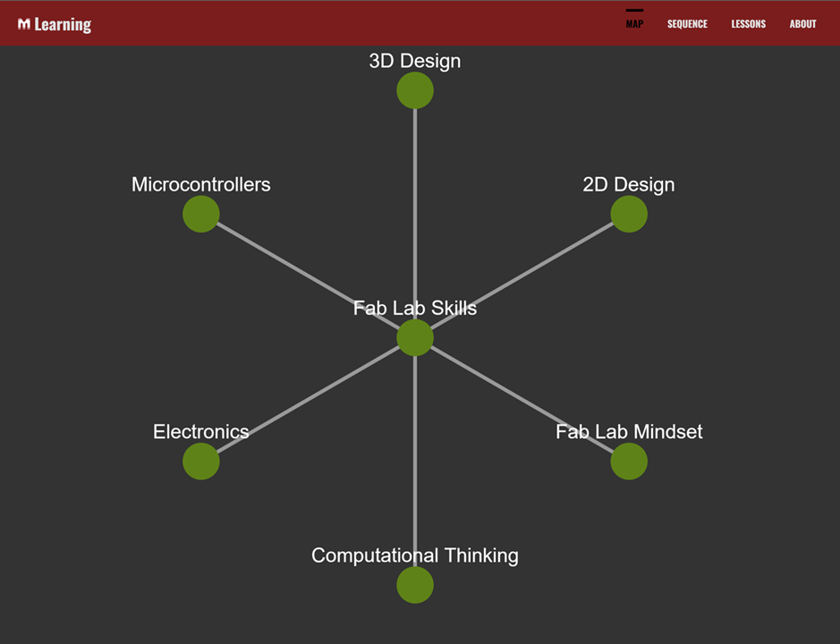

# Learner Profile Flowchart
As individual students grow and learn, their knowledge base grows and develops. Students organically and individually link ideas in their understanding of the world. Educators do well to tap into that developing konwledge base and move it forward. However, it can be difficult to assess a student's understanding to best help them grow since their understanding framework is entirely hidden within their neurons. this system hopes to bring that into full view for the student, the educator, as well as any supporting institutions so that all can work toward bettering the individual learner. 

The original idea for this flowchart style comes from Nick DiGiorgio, of Cleveland.

It took a long time to move this idea forward into the digital space...

## Progress Updates:
Starting to build with a dockerized application. 
